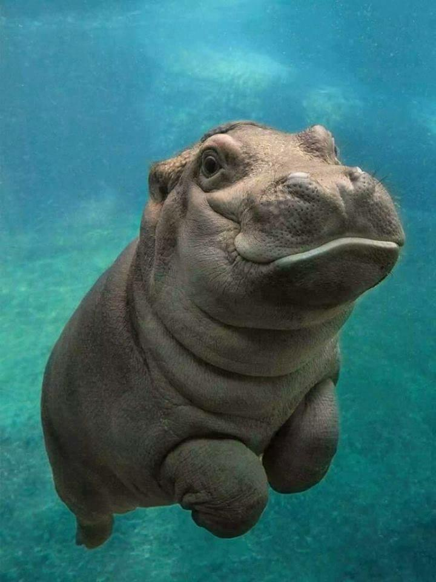
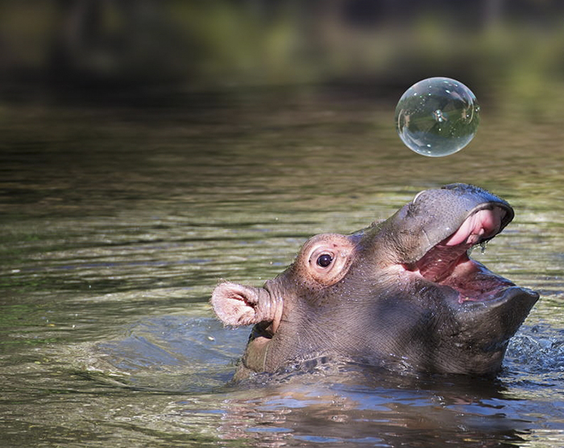

# Things that bring us joy

<h5 class="card-title">CS161 is hard.</h5>
Sometimes the going can get tough.  When that happens, we like to remember the things that make us happy!  We've added a few below.  If there's something out there on the internet that brings you joy, share it with your colleagues on Ed!
 
(While these things are fun, they are of course not the only resources available when the going gets tough.  
Check out the <a href="/resources/">Resources</a> page for more serious options.)

  

    The power of "yet"
  

  

	 
Janelle Monae sings about how we can do it!

                 

                 <iframe width="560" height="315" src="https://www.youtube.com/embed/XLeUvZvuvAs" frameborder="0" allowfullscreen></iframe>

  

  

    Folk dance sort
  

  

 Youtube videos of Hungarian folk dancers acting out sorting algorithms.  Here's QuickSort:

                 
 <iframe width="560" height="315" src="https://www.youtube.com/embed/ywWBy6J5gz8" frameborder="0" allowfullscreen></iframe>

                 
 (And there are tons more!)

        

  

  

    Baby hippos
  

  

        

 So cute!!!

        
    

  

